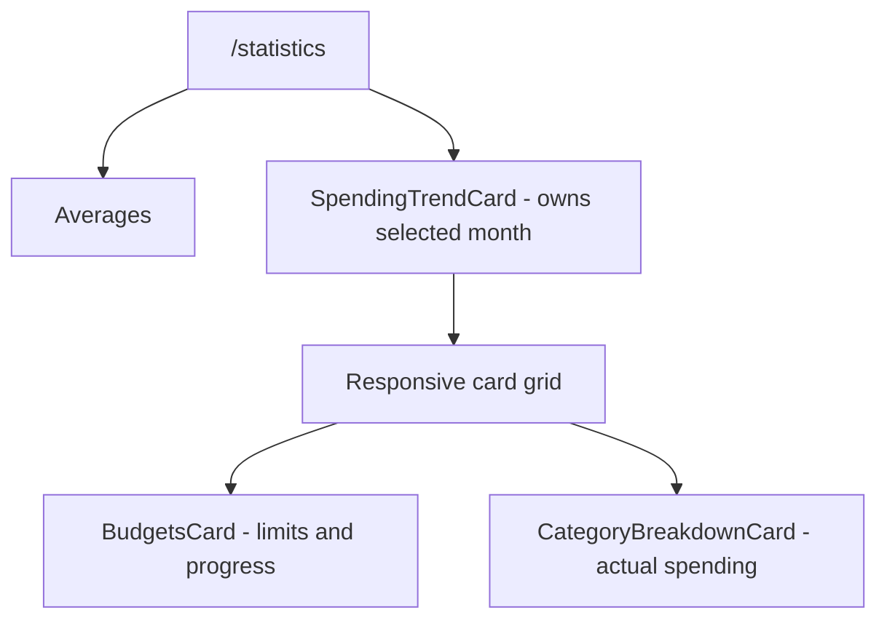

# Budgets Plan

Implement monthly category budgets on `/statistics`, with limits entered in the user's chosen
currency and progress derived from the same in-memory working set as the existing statistics. Read
`docs/architecture.md` first — budgets follow the local-first mutation path and never introduce a
query-backed derivation.

## Scope

- [ ] `budgets` table plus the synced-table implementation checklist below (reference table)
- [ ] `compute-budget-progress.ts` (+ unit test) — pure, like every other derivation
- [ ] `BudgetsCard` on `/statistics`, create/edit/delete in a Dialog
- [ ] A `toCurrency` helper beside `toUsd` in `src/utils/money.ts`

### Synced-table implementation checklist

Every new replicated table touches the same eleven places. It is copied into this feature plan so
budgets can be implemented independently of the other plans.

1. **`src/database/tables.ts`** — the table: `syncedId()` primary key, `profileId` (the scoping
   column every read and every ownership check keys on, `notNull` — the `profiles.userId`
   exception exists only for pre-auth migration rows), `...syncColumns`, and the composite
   index `(profileId, updatedAt, id)` — every read is profile-scoped and the delta pull walks
   `(updatedAt, id)` order, the same dual-purpose index `accounts` carries.
2. **Migration** — `pnpm db:generate`, then `pnpm db:migrate`. Never `drizzle-kit push`.
3. **`src/modules/sync/synced-tables.ts`** — add `budgets` to `SYNCED_TABLES` (parents-first) and
   `SWEPT_TABLES` (children-before-parents, per the cascade rationale in that file). The invariant
   test for the shared table lists goes red until both lists agree — that is it working.
4. **`src/modules/sync/sync-types.ts`** — `SyncedBudget` from `$inferSelect`, with any
   server-only columns omitted, the `SyncedRows` member, `BudgetPayload`
   (`ClientColumns<SyncedBudget>` minus what the server stamps, plus `profileId` via `Owned<T>`),
   and the `MutationPayloads` member.
5. **`src/modules/sync/idb.ts`** — bump `DATABASE_VERSION` to the next integer for this feature
   (it is currently 2; if another table lands first, use the next version after that). The
   `upgradeneeded` handler currently deletes _every_ store — including `outbox`, which is not a
   cache and whose entries exist nowhere else. **Skip `OUTBOX_STORE` in the delete loop** (its
   shape is unchanged; keep it), delete only the replicated stores, then recreate them from
   `SYNCED_TABLES`. The store-creation loop picks `budgets` up for free.
6. **`src/modules/sync/useSyncStore.ts`** — add the `budgets` state member, `initialState()`,
   `applyRows`/`mergeRows` plumbing, `clearWorkingSet`, and `replaceRows` where the existing
   synced tables appear.
7. **`src/modules/sync/sync-engine.ts`** — budgets are a _reference table_: add `budgets` to
   `REFERENCE_TABLES` so the boot gate waits for it. Reference tables are small and required for
   the app to render; streaming tables like `transactions` arrive behind the open app.
8. **`src/api/sync.functions.ts`** — add the budgets pull branch (select + keyset cursor), the
   `budgets` member of `pullChangesSchema.cursors`, and its payload schema to the push union.
9. **`src/api/apply-mutations.server.ts`** — add the budgets `target`/`set`/`setWhere` branch to
   the per-table switch, following the `categories` branch and its ownership guard through
   `ownProfileIds`. Conflicts, tombstoning and balance recomputation are generic.
10. **`src/modules/budgets/budget-mutations.ts`** — add the `create/update/delete` trio over
    `commit()` and `newRow()`, shaped like `category-mutations.ts`.
11. **Green** — `pnpm typecheck`, `pnpm test:unit`, `pnpm knip` (every export consumed), and one
    round of the E2E fixtures in `e2e/fixtures/auth.ts`, which will exercise the new table's store
    path for free.

### What exists today

No budget concept exists. The two halves it needs are both already standing: `categories` (with
`CategoryRow` carrying `colorHex` for tinting), and the statistics page's month machinery —
`computeAvailableSpendingMonths` picks the months, the `month` search param is shared by the trend
and the breakdown, and `computeCategorySpending` already computes exactly the number a budget is
compared against (a month's per-category EXPENSE total in USD, local month bounds, `toUsd` at the
account's rate, no-account rows skipped).

### Design

- **Schema** (`budgets`): `profileId` notNull, `categoryId` notNull FK to categories, and — the
  one real decision — **`currencyCode` + `monthlyLimit money`**, not a bare number. A budget is
  a personal commitment made in a currency the user thinks in ("500 EUR for groceries"), not a
  USD statistic; the statistics page speaks USD because it compares across accounts, but a limit
  is set once, in one currency. Conversion needs one small helper: `toCurrency(amount, from, to,
usdRates)` beside `toUsd` (`usdRates` are units per 1 USD, so it is a divide then a multiply —
  same fallback-to-1:1 rule, same file). The cheaper cut — USD-only budgets, matching the
  statistics axis — is a legitimate fallback if the picker proves fussy; write the choice in the
  card's props.
- **One budget per (profile, category).** No unique constraint enforces it (UUIDs, offline
  creation), same as nothing enforces a category's name being unique — the UI offers the
  un-budgeted categories only, and a duplicate that slips through renders as two rows, not as a
  corrupt state.
- **The derivation**: `computeBudgetProgress({ transactions, accounts, budgets, usdRates, month,
categories })` → per budget: spent (the same loop as `computeCategorySpending`, converted to
  the budget's currency instead of USD), `monthlyLimit`, `share` (0–1, what sizes the bar,
  unrounded like `computeCategorySpending.share`), and `isOver`. Budgets whose category has
  been tombstoned are skipped — the store no longer holds the category, which is the app's
  single notion of gone.
- **Placement**: `/statistics`, in a responsive two-column grid with `CategoryBreakdownCard`
  after `SpendingTrendCard` (side by side on wide screens, stacked on phones). Both cards use the
  month already selected by the trend card; do not add a second month selector or URL parameter.
  A budget's whole meaning is "this month against a limit", so it belongs on the page that already
  owns "this month". Management (create with category + currency + limit, edit, delete) lives in a
  Dialog inside the card, listing the profile's categories; the import wizard's
  `generateUniqueHexColors` pattern is the precedent for a form that creates rows across tables in
  one commit.
- **Card contract**: each row shows the category color/name, spent and monthly limit in the budget's
  currency, a progress bar sized by `share`, and either the remaining amount or the overage. Use
  semantic `accent` styling while a budget is within its limit and `danger` styling when `isOver`;
  the empty state explains the feature and keeps **Add budget** visible. Edit and delete actions
  stay on the row without changing the month selection.
- **Partial-sync honesty**: while `pending` holds `transactions`, progress is a climbing figure,
  exactly like the balances and every other card on that page — the sync indicator already says
  so, and the card inherits that for free by living on the same page. Nothing new to build; just
  do not "fix" it per-card.

### Visual sketches

These are implementation wireframes, not final pixel measurements. They make the intended hierarchy
and responsive behavior concrete while reusing the existing `Card`, `Title`, money formatting, and
month-selector conventions.

#### `/statistics` placement



On a wide screen, the cards share a row after the full-width trend. On a phone, the same reading
order becomes one card per row:

```text
+----------------------------------------------------------------------------+
| Statistics                                                                 |
|                                                                            |
| +------------------------------------------------------------------------+ |
| | Spending trend                         [previous] January 2026 [next]  | |
| |                                                                        | |
| |                         chart / cumulative spend                       | |
| +------------------------------------------------------------------------+ |
|                                                                            |
| +----------------------------------+  +----------------------------------+ |
| | Budgets                 [+ Add]  |  | Where the money went             | |
| | January 2026                     |  | January 2026                     | |
| |                                  |  |                                  | |
| | Groceries      EUR 320 / EUR 500|  | Groceries             EUR 410     | |
| | [####################------] 64%|  | [################----------]     | |
| |                                  |  |                                  | |
| | Dining         EUR 230 / EUR 200|  | Dining                EUR 230     | |
| | [##############################] |  | [##############------------]     | |
| |                    EUR 30 over  |  |                                  | |
| +----------------------------------+  +----------------------------------+ |
+----------------------------------------------------------------------------+
```

The mobile version uses the same card contents, but the two bottom cards stack vertically instead
of shrinking their progress labels below a usable width.

#### Create and edit dialog

```text
+--------------------------------------+
| New budget                         X  |
+--------------------------------------+
| Category                             |
| [ Groceries                       v ] |
|                                      |
| Currency                             |
| [ EUR                             v ] |
|                                      |
| Monthly limit                        |
| [ 500.00                            ] |
|                                      |
|              [Cancel] [Create budget]|
+--------------------------------------+
```

Editing uses the same fields and layout with an **Edit budget** title and **Save changes** action.
The category list contains only categories without a budget for the current profile; the currency
field defaults to the profile's chosen currency if one exists, otherwise the first supported option.

#### Empty state

```text
+------------------------------------------------+
| Budgets                              [+ Add]   |
|                                                |
| No budgets yet. Set a monthly limit for a      |
| category to start tracking progress.           |
|                                                |
|                 [Add your first budget]        |
+------------------------------------------------+
```

### Verification

The derivation is where the correctness lives: unit-test `compute-budget-progress` the way
`compute-category-spending.test.ts` does (month bounds, multi-currency accounts, over-budget
boundary, deleted category, no-account rows). The rest is the green list above plus
a manual pass: create a budget, watch the bar fill against the breakdown card's number for the
same category — the two must agree, because they are the same loop.

### Out of scope and limitations

- Budget rollovers and periods other than monthly; the statistics page's calendar is monthly.
- Progress is only as complete as the local transaction working set during an active sync.
- An unknown currency rate follows the existing 1:1 fallback used by every USD-derived figure.
