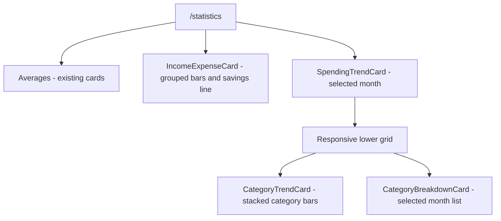
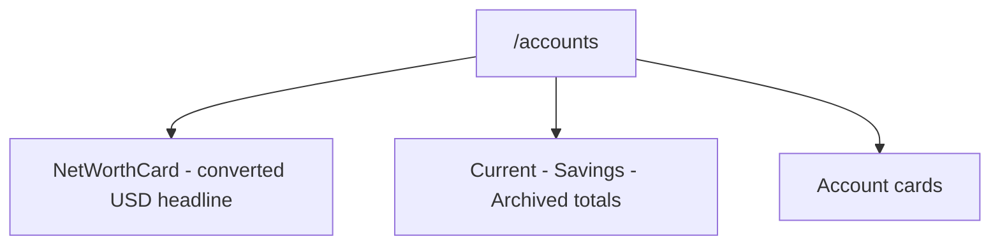

# Income, Expense, Trends & Net Worth Plan

Add three pure derivations and their cards to answer income-versus-expense, category trends, and
multi-currency net worth. Read `docs/architecture.md` first — this plan intentionally adds no
schema, sync, or store changes; every result is computed from the in-memory working set.

## Scope

- [ ] `compute-monthly-income-expense.ts` (+ test) and an `IncomeExpenseCard`
- [ ] `compute-category-trend.ts` (+ test) — months × categories, stacked bars
- [ ] `compute-net-worth.ts` (+ test) — balances per currency, one USD total, on `/accounts`

### What exists today

The statistics page is three pure functions and five cards, all over the same in-memory array
("what used to be 216 lines of SQL and three round trips"). `computeMonthlySpendingTrend` and
`computeCategorySpending` already establish every convention a new one needs: local month bounds
via `startOfMonth`/`addMonths`, `toUsd` at the _account's_ rate (rows without an account cannot
be placed on a USD axis and are skipped), magnitudes for EXPENSE (stored negative), unrounded
shares, `toSorted` largest-first. `toAccountsWithBalance` already computes per-account balances
from `initialBalance` + transactions. All three new functions are these patterns recombined —
no schema, no sync, no store changes.

### Derivations and UI

- **Income vs. expense by month** — `computeMonthlyIncomeExpense({ transactions, accounts,
usdRates, months: 12 })`: one point per month, `incomeUsd` (INCOME, magnitudes) and
  `expenseUsd` (EXPENSE, magnitudes), same bounds/currency/skip rules as the trend. The chart is
  a grouped bar pair per month (Recharts is already a dependency — `SpendingTrendCard` is the
  styling precedent); savings rate (`(income − expense) / income`, guarded against zero) is a
  free line on the same axis and the one number that makes the pair worth a card.
- **Category breakdown over time** — `computeCategoryTrend({ …, months: 12 })`: the months ×
  categories matrix, each cell a USD total under the same rules as `computeCategorySpending`,
  rendered as stacked bars, one stack per month. Two practical decisions to write into the card:
  **top N categories + "Other"** (a 30-category stack is unreadable at 320px — N ≈ 6, "Other"
  colored with the neutral `graphite` token), and month labels rendered from the same
  `yyyy-MM` strings the month selector already uses. The matrix comes out of one pass over
  transactions into a `Map<month, Map<categoryId, total>>` — the same accumulator shape as the
  existing functions, one level deeper.
- **Per-currency net worth** — `computeNetWorth(accounts, transactions, usdRates)`: per
  `currencyCode`, the sum of `toAccountsWithBalance` balances (this one does _not_ convert
  inside the loop — the whole point is the native figure), plus one converted USD total across
  currencies via `toUsd` for the single headline number. Group by currency, sum per group,
  format with the existing money formatting. Placement: **`/accounts`**, in a `NetWorthCard` above
  or beside `computeBalanceTotals`' current/savings/archived cards — that page already owns "what
  am I worth", and net worth per currency is that question answered honestly for multi-currency
  users, where the USD-only totals quietly hide the composition.

### Visual sketches

These are implementation wireframes, not final pixel measurements. They show the information
hierarchy, responsive behavior, and the relationship between the new cards and the existing
statistics/account cards.

#### `/statistics` placement



On a wide screen, the new income/expense chart gets the width needed for twelve months. The
category trend and the existing selected-month breakdown share the lower row. On a phone, the
same reading order stacks one card per row:

```text
+----------------------------------------------------------------------------+
| Statistics                                                                |
+----------------------------------------------------------------------------+
| Averages                                                                  |
| [Income / day]       [Spent / day]       [Money runway]                   |
+----------------------------------------------------------------------------+
| Income vs. expense                               Jan 2026 - Dec 2026       |
|                                                                        %  |
| Income       ||||||||||||||||||       Expense       |||||||||             |
| Savings rate 24%                                                           |
|                                                                            |
|                 grouped bars by month + savings-rate line                |
+----------------------------------------------------------------------------+
| Spending trend                                      [<] January 2026 [>]  |
|                                                                            |
|                 cumulative spending chart                                 |
+----------------------------------------------------------------------------+
| Category trend                            | Where the money went           |
| Jan  Feb  Mar  Apr  May  Jun ...         | Groceries          USD 410      |
| [A][A][B] [A][B][B] [A][A][C] ...        | Dining             USD 230      |
| [A][A][B] [A][B][C] [A][A][C] ...        | Transport          USD 120      |
| legend: Groceries, Dining, Other         | ranked bars for January        |
+----------------------------------------------------------------------------+
```

The `SpendingTrendCard` remains the single owner of the selected month. `CategoryBreakdownCard`
reads that same month; `CategoryTrendCard` is the twelve-month view and does not introduce a second
selector.

#### `/accounts` net-worth card



The card keeps the headline conversion separate from the native balances, so a user can see both
composition and one comparable total:

```text
+----------------------------------------------------------+
| Net worth                                                |
|                                                          |
|                 approx. USD 12,450.00                    |
|                                                          |
| USD       USD 8,200.00                                   |
| EUR       EUR 2,000.00                 approx. USD 2,180 |
| GEL       GEL 5,800.00                 approx. USD 2,070 |
+----------------------------------------------------------+
| Current accounts     USD 8,200                           |
| Savings accounts     EUR 2,000                           |
| Archived accounts    GEL 5,800                           |
+----------------------------------------------------------+
```

On mobile, `NetWorthCard` becomes a full-width card followed by the existing account totals and
account cards. If the working set is empty, use the existing empty-state tone rather than showing a
zero-valued chart; if a month has no income, show the zero-guarded savings rate as unavailable rather
than dividing by zero.

### Verification

Three new test files beside the existing two, same fixtures-and-edge-cases style: month
boundaries, multi-currency accounts, zero-income months, the empty working set, and (for net
worth) an account with no transactions. Manual pass: cross-check one month of the income/expense
card against the trend card's final cumulative point and the breakdown card's total — three
functions, one number, by construction.

### Limitations

These derivations remain bounded by the local working set and inherit the existing partial-sync
behavior: figures can climb while transactions are still pending. Rows without an account remain
excluded from USD-axis calculations, as they are today.
